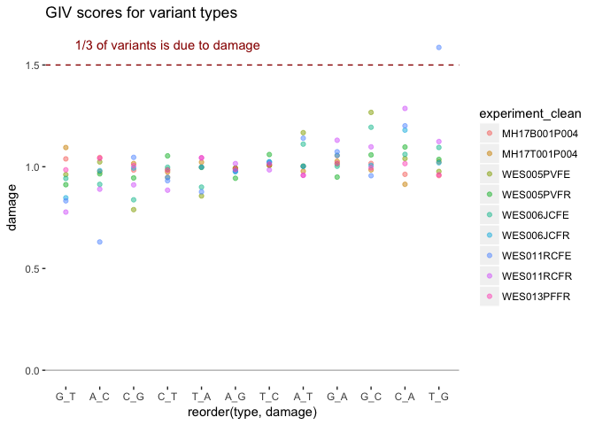
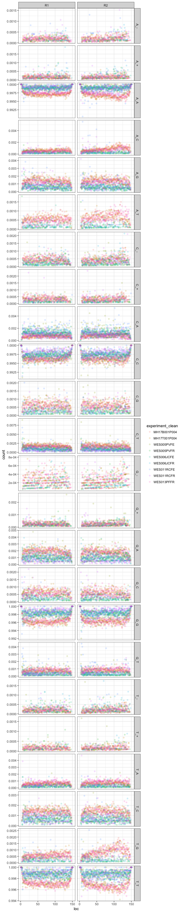

# DNA Damage Estimation
Peter Diakumis  
22 August 2017  


```r
library(ggplot2)
library(dplyr)
library(readr)
```

## Estimate total and positional damage

### Snakemake rules

```
rule count_mutations:
    """Count mutations in read pileup"""
    input:
        pileup = config['out_dir'] + '{sample}_f{flag}.mpileup'
    output:
        counts_tot = config['out_dir'] + '{sample}_f{flag}_counts_tot.tsv',
        counts_pos = config['out_dir'] + '{sample}_f{flag}_counts_pos.tsv'
    log:
        config['log_dir'] + '{sample}_f{flag}_counts.log'
    threads: 1
    shell:
        "perl ../scripts/count_mutations.pl --in_mp {input.pileup} "
        "--out_ct {output.counts_tot} --out_cp {output.counts_pos} 2> {log}"

rule estimate_damage:
    """Estimate damage scores"""
    input:
        ct1 = config['out_dir'] + '{sample}_f64_counts_tot.tsv',
        ct2 = config['out_dir'] + '{sample}_f128_counts_tot.tsv',
        cp1 = config['out_dir'] + '{sample}_f64_counts_pos.tsv',
        cp2 = config['out_dir'] + '{sample}_f128_counts_pos.tsv'
    output:
        tot = config['out_dir'] + '{sample}_tot_damage.tsv',
        pos = config['out_dir'] + '{sample}_pos_damage.tsv'
    log:
        config['log_dir'] + '{sample}_damest.log'
    threads: 1
    shell:
        "perl ../scripts/damest.pl "
        "--ct1 {input.ct1} --ct2 {input.ct2} "
        "--cp1 {input.cp1} --cp2 {input.cp2} "
        "--out_tot {output.tot} --out_pos {output.pos} "
        "--id {wildcards.sample} 2> {log}"
```

### Plots


```r
require(dplyr)
require(readr)
require(ggplot2)
```


```r
#--- Total damage ---#
fnames <- list.files("/Users/pdiakumis/Desktop/git/dandam/data/out", pattern = "tot_damage.tsv$", full.names = TRUE)
fnames
```

```
[1] "/Users/pdiakumis/Desktop/git/dandam/data/out/MH17B001P004-ready_chr21_2pc_tot_damage.tsv"
[2] "/Users/pdiakumis/Desktop/git/dandam/data/out/MH17T001P004-ready_chr21_1pc_tot_damage.tsv"
[3] "/Users/pdiakumis/Desktop/git/dandam/data/out/WES005PVFE_chr21_tot_damage.tsv"            
[4] "/Users/pdiakumis/Desktop/git/dandam/data/out/WES005PVFR_chr21_tot_damage.tsv"            
[5] "/Users/pdiakumis/Desktop/git/dandam/data/out/WES006JCFE_chr21_tot_damage.tsv"            
[6] "/Users/pdiakumis/Desktop/git/dandam/data/out/WES006JCFR_chr21_tot_damage.tsv"            
[7] "/Users/pdiakumis/Desktop/git/dandam/data/out/WES011RCFE_chr21_tot_damage.tsv"            
[8] "/Users/pdiakumis/Desktop/git/dandam/data/out/WES011RCFR_chr21_tot_damage.tsv"            
[9] "/Users/pdiakumis/Desktop/git/dandam/data/out/WES013PFFR-sort_chr21_1pc_tot_damage.tsv"   
```

```r
type_clean <-c("G_T", "C_A", "C_T", "G_A", "T_A", "A_T",
               "A_G", "T_C", "C_G", "G_C", "T_G", "A_C")
mut_list <- lapply(fnames, function(f) {
  mut <- readr::read_tsv(f,
                         col_names =  c("abs", "type", "experiment", "count", "family", "damage"),
                         col_types = "iccdcd") %>%
    filter(type %in% type_clean) %>%
    mutate(type = factor(type, level = type_clean))
  mut
})

mut_all <- dplyr::bind_rows(mut_list)
mut_all <- mut_all %>% 
  mutate(experiment_clean = sub("^\\/(.*).*_chr21.*", "\\1", experiment),
         experiment_clean = sub("-(sort|ready)", "", experiment_clean))

table(mut_all$experiment_clean, useNA = "ifany")
```

```

MH17B001P004 MH17T001P004   WES005PVFE   WES005PVFR   WES006JCFE 
          12           12           12           12           12 
  WES006JCFR   WES011RCFE   WES011RCFR   WES013PFFR 
          12           12           12           12 
```

```r
# no log
g <- ggplot(mut_all, aes(x = reorder(type, damage), y = damage, color = experiment_clean))
g + geom_point(alpha = 1/2, size=1.5) +
  geom_hline(yintercept = 1.5, color = "#990000", linetype = "dashed") +
  annotate("text", x = 4, y = 1.6, color = "#990000",
           label = "1/3 of variants is due to damage") +
  geom_hline(yintercept = 0, color = "grey") +
  theme(panel.background = element_rect(fill = 'white', colour = 'white')) +
  ggtitle("GIV scores for variant types")
```

<!-- -->
 

```r
#--- Position damage ---#
rm(list=ls())
fnames <- list.files("/Users/pdiakumis/Desktop/git/dandam/data/out", pattern = "pos_damage.tsv$", full.names = TRUE)

mut_list <- lapply(fnames, function(f) {
  mut <- readr::read_tsv(f,
                         col_names = c("experiment", "type", "read", "count", "abs", "loc"),
                         col_types = c("cccdii"))
  mut
})

mut_all <- dplyr::bind_rows(mut_list)
mut_all <- mut_all %>% 
  mutate(experiment_clean = sub("^\\/(.*).*_chr21.*", "\\1", experiment),
         experiment_clean = sub("-(sort|ready)", "", experiment_clean))

ggplot(mut_all) +
  geom_point(aes(x = loc, y = count, colour = experiment_clean), alpha = 1/6) +
  theme_bw() +
  facet_grid(type~read, scales = "free_y")
```

<!-- -->

