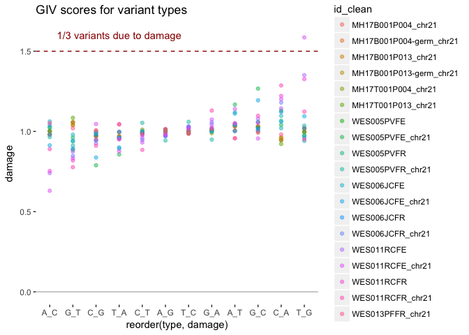
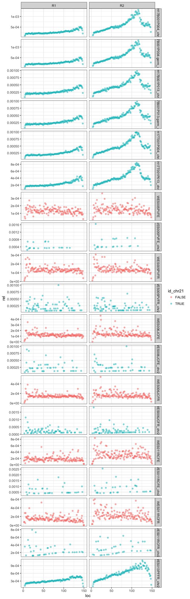

# DNA Damage Estimation
Peter Diakumis  
31 August 2017  


```r
library(ggplot2)
library(dplyr)
library(readr)
```

## Data
Used chr21 `BAM` subset of following samples:

```r
list.files("~/Desktop/git/dna-damage-estimation/data/new", pattern = "chr21") %>%
  sub("(.*)_chr21_(tot|pos|con)_damage.tsv", "\\1", .) %>% 
  sub("-ready", "", .) %>% 
  sub("-sort", "", .) %>% 
  sub("-germline", "_germ", .) %>% 
  unique()
```

```
 [1] "MH17B001P004_germ" "MH17B001P004"      "MH17B001P013_germ"
 [4] "MH17B001P013"      "MH17T001P004"      "MH17T001P013"     
 [7] "WES005PVFE"        "WES005PVFR"        "WES006JCFE"       
[10] "WES006JCFR"        "WES011RCFE"        "WES011RCFR"       
[13] "WES013PFFR"       
```

And whole `BAM`s of following samples:

```r
list.files("~/Desktop/git/dna-damage-estimation/data/new", pattern = "[ER]_(tot|pos|con)_damage.tsv") %>% 
  sub("_(tot|pos|con)_damage.tsv", "", .) %>% 
  unique()
```

```
[1] "WES005PVFE" "WES005PVFR" "WES006JCFE" "WES006JCFR" "WES011RCFE"
[6] "WES011RCFR"
```

## Estimate total, positional, and context damage

### Functions

```r
read_tot_damage <- function(fname) {
  readr::read_tsv(fname, 
                  col_names = c("abs", "type", "id", "count", "family", "damage"),
                  col_types = "iccdcd") %>% 
    arrange(type)
}

read_pos_damage <- function(fname) {
  readr::read_tsv(fname,
                 col_names = c("id", "type", "read", "rel", "abs", "loc"),
                 col_types = "cccdii") %>% 
    arrange(type, read, loc)
}

read_con_damage <- function(fname) {
  readr::read_tsv(fname,
                  col_names = c("id", "type", "read", "rel", "loc", "context", "abs"),
                  col_types = "cccdici") %>% 
    arrange(type, read, loc, context)
}
```


### Plots


#### Total Damage

```r
fnames <- list.files("~/Desktop/git/dna-damage-estimation/data/new",
                     pattern = "tot_damage.tsv$", full.names = TRUE)
basename(fnames)
```

```
 [1] "MH17B001P004-germline-ready_chr21_tot_damage.tsv"
 [2] "MH17B001P004-ready_chr21_tot_damage.tsv"         
 [3] "MH17B001P013-germline-ready_chr21_tot_damage.tsv"
 [4] "MH17B001P013-ready_chr21_tot_damage.tsv"         
 [5] "MH17T001P004-ready_chr21_tot_damage.tsv"         
 [6] "MH17T001P013-ready_chr21_tot_damage.tsv"         
 [7] "WES005PVFE_chr21_tot_damage.tsv"                 
 [8] "WES005PVFE_tot_damage.tsv"                       
 [9] "WES005PVFR_chr21_tot_damage.tsv"                 
[10] "WES005PVFR_tot_damage.tsv"                       
[11] "WES006JCFE_chr21_tot_damage.tsv"                 
[12] "WES006JCFE_tot_damage.tsv"                       
[13] "WES006JCFR_chr21_tot_damage.tsv"                 
[14] "WES006JCFR_tot_damage.tsv"                       
[15] "WES011RCFE_chr21_tot_damage.tsv"                 
[16] "WES011RCFE_tot_damage.tsv"                       
[17] "WES011RCFR_chr21_tot_damage.tsv"                 
[18] "WES011RCFR_tot_damage.tsv"                       
[19] "WES013PFFR-sort_chr21_tot_damage.tsv"            
```

```r
type_clean <-c("G_T", "C_A", "C_T", "G_A", "T_A", "A_T",
               "A_G", "T_C", "C_G", "G_C", "T_G", "A_C")
mut_list <- lapply(fnames, function(f) {
  mut <- read_tot_damage(f) %>% 
    filter(type %in% type_clean) %>%
    mutate(type = factor(type, level = type_clean))
  mut
})

mut_all <- dplyr::bind_rows(mut_list)
mut_all <- mut_all %>% 
  mutate(id_clean = sub("^\\/", "", id),
         id_clean = sub("-(sort|ready)", "", id_clean),
         id_clean = sub("-germline", "-germ", id_clean)) %>% 
  mutate(id_joint = sub("_chr21", "", id_clean),
         id_chr21 = grepl("chr21", id_clean))

mut_all %>% 
  ggplot(aes(x = reorder(type, damage), y = damage)) +
  geom_point(alpha = 1/2, size = 1.5, aes(colour = id_clean)) +
  geom_hline(yintercept = 1.5, color = "#990000", linetype = "dashed") +
  annotate("text", x = 4, y = 1.6, color = "#990000",
           label = "1/3 variants due to damage") +
  geom_hline(yintercept = 0, color = "grey") +
  theme(panel.background = element_rect(fill = 'white', colour = 'white')) +
  ggtitle("GIV scores for variant types") 
```

<!-- -->

__Compare chr21 subset to whole bam__

```r
mut_all %>% 
  filter(
    grepl(
      paste0("WES", c("005PV", "006JC", "011RC"), rep(c("FR", "FE"), 3),
             collapse = "|"),
      id_clean)) %>% 
  ggplot(aes(x = reorder(type, damage), y = damage)) +
  geom_point(alpha = 1/2, size = 1.5, aes(colour = id_chr21)) +
  geom_hline(yintercept = 1.5, color = "#990000", linetype = "dashed") +
  annotate("text", x = 4, y = 1.6, color = "#990000",
           label = "1/3 variants due to damage") +
  geom_hline(yintercept = 0, color = "grey") +
  theme(panel.background = element_rect(fill = 'white', colour = 'white')) +
  ggtitle("GIV scores for variant types") +
  facet_wrap(~id_joint, ncol = 2)
```

<!-- -->
 
#### Position Damage

```r
fnames <- list.files("~/Desktop/git/dna-damage-estimation/data/new",
                     pattern = "pos_damage.tsv$", full.names = TRUE)
basename(fnames)
```

```
 [1] "MH17B001P004-germline-ready_chr21_pos_damage.tsv"
 [2] "MH17B001P004-ready_chr21_pos_damage.tsv"         
 [3] "MH17B001P013-germline-ready_chr21_pos_damage.tsv"
 [4] "MH17B001P013-ready_chr21_pos_damage.tsv"         
 [5] "MH17T001P004-ready_chr21_pos_damage.tsv"         
 [6] "MH17T001P013-ready_chr21_pos_damage.tsv"         
 [7] "WES005PVFE_chr21_pos_damage.tsv"                 
 [8] "WES005PVFE_pos_damage.tsv"                       
 [9] "WES005PVFR_chr21_pos_damage.tsv"                 
[10] "WES005PVFR_pos_damage.tsv"                       
[11] "WES006JCFE_chr21_pos_damage.tsv"                 
[12] "WES006JCFE_pos_damage.tsv"                       
[13] "WES006JCFR_chr21_pos_damage.tsv"                 
[14] "WES006JCFR_pos_damage.tsv"                       
[15] "WES011RCFE_chr21_pos_damage.tsv"                 
[16] "WES011RCFE_pos_damage.tsv"                       
[17] "WES011RCFR_chr21_pos_damage.tsv"                 
[18] "WES011RCFR_pos_damage.tsv"                       
[19] "WES013PFFR-sort_chr21_pos_damage.tsv"            
```

```r
mut_list <- lapply(fnames, read_pos_damage)

mut_all <- dplyr::bind_rows(mut_list)
mut_all <- mut_all %>%
  mutate(id_clean = sub("^\\/", "", id),
         id_clean = sub("-(sort|ready)", "", id_clean),
         id_clean = sub("-germline", "-germ", id_clean)) %>%
  mutate(id_joint = sub("_chr21", "", id_clean),
         id_chr21 = grepl("chr21", id_clean))
```

__Example for type T-G__

```r
mut_all %>%
  filter(type == "T_G") %>%
  ggplot() +
  geom_point(aes(x = loc, y = rel, colour = id_chr21), alpha = 1/2) +
  theme_bw() +
  facet_grid(id_clean ~ read, scales = "free_y")
```

<!-- -->

__All types shown in separate folder__

```r
for (t in type_clean) {
  g <- mut_all %>%
    filter(type == t) %>%
    ggplot() +
    geom_point(aes(x = loc, y = rel), alpha = 1/2) +
    theme_bw() +
    facet_grid(id2 ~ read, scales = "free_y") +
    ggtitle(paste0("Fraction of ", substr(t, 1, 1), " to ", substr(t, 3, 3), " variants on R1 and R2"))
  ggsave(plot = g, filename = paste0("figs/pos_dam_type_", t, ".png"), height = 20, width = 15)
}
```

#### Context Damage

```r
context_clean <- paste0(c("A", "T", "C", "G"), "_BASE_", rep(c("A", "T", "C", "G"), each = 4))
fnames <- list.files("~/Desktop/git/dna-damage-estimation/data/new",
                     pattern = "con_damage.tsv$", full.names = TRUE)
basename(fnames)
```

```
 [1] "MH17B001P004-germline-ready_chr21_con_damage.tsv"
 [2] "MH17B001P004-ready_chr21_con_damage.tsv"         
 [3] "MH17B001P013-germline-ready_chr21_con_damage.tsv"
 [4] "MH17B001P013-ready_chr21_con_damage.tsv"         
 [5] "MH17T001P004-ready_chr21_con_damage.tsv"         
 [6] "MH17T001P013-ready_chr21_con_damage.tsv"         
 [7] "WES005PVFE_chr21_con_damage.tsv"                 
 [8] "WES005PVFE_con_damage.tsv"                       
 [9] "WES005PVFR_chr21_con_damage.tsv"                 
[10] "WES005PVFR_con_damage.tsv"                       
[11] "WES006JCFE_chr21_con_damage.tsv"                 
[12] "WES006JCFE_con_damage.tsv"                       
[13] "WES006JCFR_chr21_con_damage.tsv"                 
[14] "WES006JCFR_con_damage.tsv"                       
[15] "WES011RCFE_chr21_con_damage.tsv"                 
[16] "WES011RCFE_con_damage.tsv"                       
[17] "WES011RCFR_chr21_con_damage.tsv"                 
[18] "WES011RCFR_con_damage.tsv"                       
[19] "WES013PFFR-sort_chr21_con_damage.tsv"            
```

```r
mut_list <- lapply(fnames, read_con_damage)

mut_all <- dplyr::bind_rows(mut_list)
mut_all <- mut_all %>%
  mutate(id_clean = sub("^\\/", "", id),
         id_clean = sub("-(sort|ready)", "", id_clean),
         id_clean = sub("-germline", "-germ", id_clean)) %>%
  mutate(id_joint = sub("_chr21", "", id_clean),
         id_chr21 = grepl("chr21", id_clean))
```

__Example for type T-G and context TBT__

```r
mut_all %>%
  filter(type == "T_G", context == "T_BASE_T") %>%
  ggplot() +
  geom_point(aes(x = loc, y = rel, colour = id_chr21), alpha = 1/2) +
  theme_bw() +
  facet_grid(id_clean ~ read, scales = "free_y")
```

<!-- -->

__All types shown in separate folder__

```r
for (t in type_clean) {
  for (con in context_clean) {

    g <- mut_all %>%
      filter(type == t) %>%
      ggplot() +
      geom_point(aes(x = loc, y = rel), alpha = 1/2) +
      theme_bw() +
      facet_grid(id2 ~ read, scales = "free_y") +
      ggtitle(paste0("Fraction of ", substr(t, 1, 1), " to ", substr(t, 3, 3), " variants on R1 and R2",
                     " in context ", con))
    ggsave(plot = g, filename = paste0("figs/con_dam_type_", t, "_cont_", con, ".png"), height = 20, width = 15)
  }
}
```
