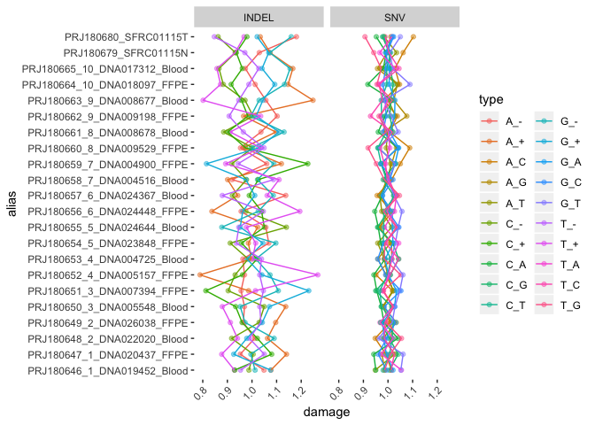

## Results


```r
require(tidyverse)
```


```r
read_tot_damage <- function(fname) {
  readr::read_tsv(fname,
                  col_names = c("abs", "type", "experiment", "count", "family", "damage"),
                  col_types = "iccdcd") %>%
    arrange(type)
}
```


## Total damage


```r
bases <- c("A", "T", "C", "G")
indel_type <- paste0(bases, rep(c("_+", "_-"), each = 4))
snv_type <- c("A_C", "A_G", "A_T", "C_A", "C_G", "C_T",
              "G_A", "G_C", "G_T", "T_A", "T_C", "T_G")

fn <- list.files("../../data/results/new", pattern = "tot_damage", 
                 full.names = TRUE, recursive = TRUE) %>%
  grep("CUP-Pairs|SFRC01115", ., value = TRUE)
tot <- 
  purrr::map(fn, read_tot_damage) %>%
  purrr::set_names(sub("_tot_damage.tsv", "", basename(fn))) %>%
  dplyr::bind_rows(.id = "sample") %>%
  dplyr::arrange(sample, family, type) %>% 
  dplyr::filter(type %in% c(indel_type, snv_type)) %>%
  dplyr::mutate(mut_type = ifelse(type %in% snv_type, "SNV", "INDEL")) %>% 
  dplyr::select(alias = sample, type, damage, mut_type)

p <- ggplot(tot, aes(x = alias, y = damage, color = type)) +
  geom_point(alpha = 1/2, size = 1.5) +
  geom_line(aes(group = type)) +
  facet_wrap(~mut_type, nrow = 1) +
  theme(panel.background = element_rect(fill = 'white', colour = 'white'),
        axis.text.x = element_text(angle = 45, vjust = 1, hjust = 1))
p + coord_flip() + guides(color = guide_legend(ncol = 2))
```

<!-- -->


