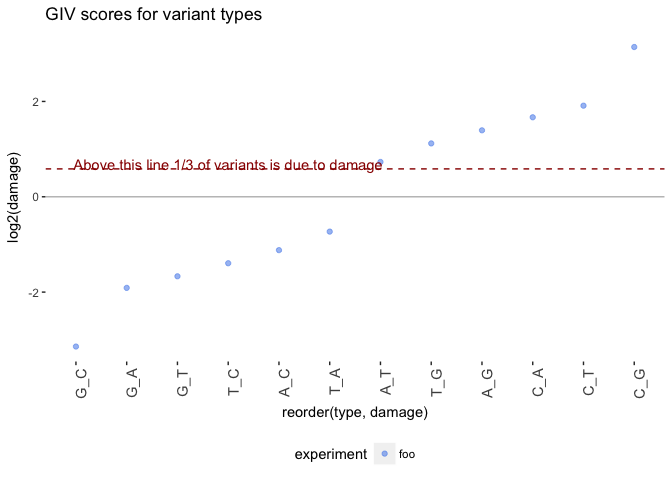

# DNA Damage Estimation
Peter Diakumis  
14 July 2017  


```r
library(ggplot2)
library(dplyr)
library(readr)
```

Here we'll run the DNA Damage Estimator scripts from the
[Ettwiller GitHub repo](https://github.com/Ettwiller/Damage-estimator).

# Example Run
An example BAM file was downloaded from
[bds](https://github.com/vsbuffalo/bds-files/tree/master/chapter-11-alignment):


```bash
ls -lLh ../../data/example
```

```
total 1848808
-rw-r--r--  1 pdiakumis  2094513965    60M 25 Jul 06:47 NA12891_CEU_sample.bam
-rw-r--r--  1 pdiakumis  2094513965   106K 25 Jul 17:42 NA12891_CEU_sample.bam.bai
-rw-r--r--  1 pdiakumis  2094513965   842M 25 Jul 17:38 human_g1k_v37.fasta.gz
-rw-r--r--  1 pdiakumis  2094513965   2.7K 25 Jul 17:41 human_g1k_v37.fasta.gz.fai
-rw-r--r--  1 pdiakumis  2094513965   755K 25 Jul 17:41 human_g1k_v37.fasta.gz.gzi
```

## Step 1: Split BAM into R1 and R2

### Command Line


```bash
perl ../../scripts/0-split_mapped_reads.pl \
  --bam ../../data/example/NA12891_CEU_sample.bam \
  --genome ../../data/example/human_g1k_v37.fasta.gz \
  --mpileup1 ../../data/out/ex_out1.mpileup \
  --mpileup2 ../../data/out/ex_out2.mpileup
```

### Output


```bash
ls -lLh ../../data/out
```

```
total 221832
-rw-r--r--  1 pdiakumis  2094513965    54M 26 Jul 11:30 ex_out1.mpileup
-rw-r--r--  1 pdiakumis  2094513965    54M 26 Jul 11:30 ex_out2.mpileup
-rw-r--r--  1 pdiakumis  2094513965   1.2K 27 Jul 08:58 foo.damage
-rw-r--r--  1 pdiakumis  2094513965    23K 27 Jul 09:02 foo2.damage
-rw-r--r--  1 pdiakumis  2094513965   175K 27 Jul 09:07 foo3.damage
```


```bash
head -n5 ../../data/out/*.mpileup
```

```
==> ../../data/out/ex_out1.mpileup <==
1	215622850	G	1	^].	;	]	1
1	215622851	G	1	.	=	]	2
1	215622852	A	1	.	<	]	3
1	215622853	A	1	.	>	]	4
1	215622854	T	1	.	=	]	5

==> ../../data/out/ex_out2.mpileup <==
1	215622860	T	1	^].	;	]	1
1	215622861	A	1	.	9	]	2
1	215622862	G	1	.	=	]	3
1	215622863	G	2	.^F,	;=	]F	4,17
1	215622864	A	2	.,	<<	]F	5,18
```

The script uses `samtools mpileup` to output a summary of the read pileup in the
given BAM file. Options used are:

* `-O`: output base positions on reads 
* `-s`: output mapping quality
* `-q`: skip alignments with mapQ smaller than [10]
* `-Q`: skip bases with baseQ/BAQ smaller than [0]


## Step 2: Estimate basic damage

### Command Line

```bash
perl ../../scripts/1a-estimate_damage.pl \
  --mpileup1 ../../data/out/ex_out1.mpileup \
  --mpileup2 ../../data/out/ex_out2.mpileup \
  --id foo \
  > ../../data/out/foo.damage
```

### Output


```bash
head -n5 ../../data/out/foo.damage
```

```
99	C_A	foo	0.00195938724617029	C_A-G_T	3.17757748485928
29	T_G	foo	4.54539042552691e-05	A_C-T_G	2.17289737814566
573427	A_A	foo	0.999606033612654	A_A-T_T	0.999863048074651
161888	G_G	foo	0.998248772907777	C_C-G_G	1.00469139675587
163	G_A	foo	0.00100510569025479	C_T-G_A	0.265884660239862
```

Column description:

1. raw count of variant type
2. variant type (ex. G_T, G to T)
3. id (from the --id option)
4. frequency of variant
5. family (the variant type and reverse complement)
6. GIV-score

If you have followed the standard protocol for acoustic shearing during library preparation you should obtain a GIV score for G_T around 2.

### Plot


```r
type_clean <-c("G_T", "C_A", "C_T", "G_A", "T_A", "A_T",
               "A_G", "T_C", "C_G", "G_C", "T_G", "A_C")
mut <- readr::read_tsv("../../data/out/foo.damage",
                       col_names =  c("abs", "type", "experiment", "count", "family", "damage"),
                       col_types = "iccdcd") %>%
  filter(type %in% type_clean) %>%
  mutate(type = factor(type, level = type_clean))

#coloring scheme (feel free to change)
local_color <- c("cornflowerblue", "royalblue4", paste0("grey", c(1, seq(10, 100, 10))))

g <- ggplot(mut, aes(x = reorder(type, damage), y = log2(damage), color = experiment))

g + geom_point(alpha = 0.6, size=1.5) +
  scale_colour_manual(values = local_color) +
  geom_hline(yintercept = log2(1.5), color = "#990000", linetype = "dashed") +
  annotate("text", x = 4, y = log2(1.6), color = "#990000",
           label = "Above this line 1/3 of variants is due to damage") +
  geom_hline(yintercept = 0, color = "grey") +
  theme(panel.background = element_rect(fill = 'white', colour = 'white'),
        legend.position = "bottom", axis.text.x = element_text(angle = 90, hjust = 1, size=11)) +
  ggtitle("GIV scores for variant types")
```

<!-- -->


## Step 3: Estimate damage relative to read position

### Command Line

```bash
perl ../../scripts/2a-estimate_damage_location.pl \
  --mpileup1 ../../data/out/ex_out1.mpileup \
  --mpileup2 ../../data/out/ex_out2.mpileup \
  --id foo2 \
  --out ../../data/out/foo2.damage
```

### Output


```bash
head -n5 ../../data/out/foo2.damage
```

```
foo2	C_C	R1	1	1437	2
foo2	C_C	R2	1	1476	2
foo2	C_C	R1	0.996913580246914	646	3
foo2	C_C	R2	0.997899159663866	475	3
foo2	C_C	R1	0.996742671009772	918	4
```

Column description:

1. id (from the --id option)
2. variant type (ex. G_T, G to T)
3. R1 or R2
4. count (freq)
5. absolute counts
6. position on the read

### Plot


```r
mut <- readr::read_tsv("../../data/out/foo2.damage",
                       col_names = c("experiment", "type", "read", "count", "abs", "loc"),
                       col_types = c("cccdii"))

ggplot(mut) +
  geom_point(aes(x = loc, y = count)) +
  theme_bw() +
  facet_grid(type~read, scales = "fixed")
```

<!-- -->

## Step 4: Estimate damage relative to read position and context

### Command Line

```bash
perl ../../scripts/3a-estimate_damage_location_context.pl \
  --mpileup1 ../../data/out/ex_out1.mpileup \
  --mpileup2 ../../data/out/ex_out2.mpileup \
  --id foo3 \
  --out ../../data/out/foo3.damage
```

### Output


```bash
head -n5 ../../data/out/foo3.damage
```

```
foo3	T_G	R1	0.000909090909090909	6	T_BASE_G	1
foo3	T_G	R2	0.00171526586620926	6	T_BASE_G	1
foo3	A_T	R1	0.00102354145342886	8	C_BASE_T	1
foo3	A_T	R2	0.00687285223367698	8	C_BASE_T	2
foo3	A_T	R1	0.00112994350282486	23	C_BASE_T	1
```

Column description:

1. id (from the --id option)
2. variant type (ex. G_T, G to T)
3. R1 or R2
4. count (freq)
5. position on the read
6. context
  * `1`: damage is analysed function of the 5' nucleotide (C_[base], G_[base], T_[base] and A_[base])
  * `2`: damage is analysed function of the 3' nucleotide ([base]_C, [base]_G, [base]_T and [base]_A)
  * `3`: damage is analysed function of the 5' and 3' nucleotides (C_[base]T, C[base]C, C[base]G,
    C[base]A, G[base]_T ....), with [base] being the variant analysed. Default is `3`.
7. count (absolute)

### Plot


```r
mut <- readr::read_tsv("../../data/out/foo3.damage",
                       col_names = c("experiment", "type", "read", "count", "loc", "context", "abs"),
                       col_types = c("cccdici"))


ggplot(mut) +
  geom_point(aes(x = loc, y = count)) +
  theme_bw() +
  facet_grid(context~read, scales = "free")
```

<!-- -->
