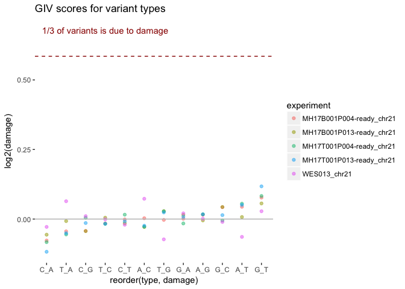
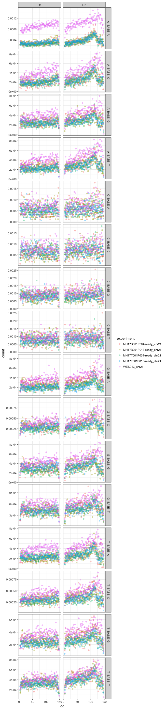

# DNA Damage Estimation
Peter Diakumis  
02 August 2017  


```r
library(ggplot2)
library(dplyr)
library(readr)
```

Here we'll run the DNA Damage Estimator scripts from the
[Ettwiller GitHub repo](https://github.com/Ettwiller/Damage-estimator).

The BAM files used are:

| FileName               | Path                            |
|------------------------|---------------------------------|
| WES013 | `projects/Hsu_WGS_Validation/WGS-WES013PF-merged/work/align/WES013PFFR/` |
| MH17B001P004-germline  | `data/Grimmond_Patients/MH17B001P004/` |
| MH17B001P004           | `''` |
| MH17T001P004           | `''` |
| MH17B001P013-germline  | `data/Grimmond_Patients/MH17B001P013/` |
| MH17B001P013           | `''` |
| MH17T001P013           | `''` |


## Step 1: Subset chr21 from BAM


```bash
BAM='path/to/bam/file.bam'
CHROM=21
samtools view ${BAM} -b ${CHROM} > "${BAM_DIR}/$(basename $BAM .bam)_chr${CHROM}.bam"
```

## Step 2: Split BAM into R1 and R2

### Command Line


```bash
perl scripts/0-split_mapped_reads.pl \
  --bam path/to/bam/file_chr21.bam \
  --genome GRCh37.fa \
  --mpileup1 sampleFoo_R1.mpileup \
  --mpileup2 sampleFoo_R2.mpileup
```

The script uses `samtools mpileup` to output a summary of the read pileup in the
given BAM file. Options used are:

* `-O`: output base positions on reads
* `-s`: output mapping quality
* `-q`: skip alignments with mapQ smaller than [10]
* `-Q`: skip bases with baseQ/BAQ smaller than [0]


## Step 3: Estimate basic damage

### Command Line

```bash
perl 1a-estimate_damage.pl \
  --mpileup1 sampleFoo_R1.mpileup \
  --mpileup2 sampleFoo_R2.mpileup
  --id sampleFoo \
  > basic.damage
```

### Output example


```bash
head -n5 ../../data/WES013/out/chr21/1-basic.damage
```

```
78027	A_-	WES013_chr21	0.000142991974019036	A_--T_-	0.992122700833584
64858	T_+	WES013_chr21	0.000120602884032636	A_+-T_+	1.00324490588557
65597	A_+	WES013_chr21	0.000120212804794837	A_+-T_+	0.996765589472189
544696039	A_A	WES013_chr21	0.99820782366309	A_A-T_T	1.00000117306157
210900	A_C	WES013_chr21	0.000386494512420249	A_C-T_G	1.05186511716856
```

Column description:

1. raw count of variant type
2. variant type (ex. G_T, G to T)
3. id (from the --id option)
4. frequency of variant
5. family (the variant type and reverse complement)
6. GIV-score


### Plot


```r
type_clean <-c("G_T", "C_A", "C_T", "G_A", "T_A", "A_T",
               "A_G", "T_C", "C_G", "G_C", "T_G", "A_C")
fnames <- list.files("data", pattern = "basic.damage$", full.names = TRUE)

mut_list <- lapply(fnames, function(f) {
  mut <- readr::read_tsv(f,
                         col_names =  c("abs", "type", "experiment", "count", "family", "damage"),
                         col_types = "iccdcd") %>%
    filter(type %in% type_clean) %>%
    mutate(type = factor(type, level = type_clean))
  mut
})

mut_all <- dplyr::bind_rows(mut_list)

g <- ggplot(mut_all, aes(x = reorder(type, damage), y = log2(damage), color = experiment))

g + geom_point(alpha = 1/2, size=1.5) +
  geom_hline(yintercept = log2(1.5), color = "#990000", linetype = "dashed") +
  annotate("text", x = 4, y = log2(1.6), color = "#990000",
           label = "1/3 of variants is due to damage") +
  geom_hline(yintercept = 0, color = "grey") +
  theme(panel.background = element_rect(fill = 'white', colour = 'white')) +
  ggtitle("GIV scores for variant types")
```

<!-- -->


## Step 4: Estimate damage relative to read position

### Command Line

```bash
perl scripts/2a-estimate_damage_location.pl \
  --mpileup1 sampleFoo_R1.mpileup \
  --mpileup2 sampleFoo_R2.mpileup \
  --id sampleFoo \
  --out loc.damage
```

### Output Example


```bash
head -n5 ../../data/WES013/out/chr21/2-loc.damage
```

```
WES013_chr21	A_-	R1	0.000111230366756855	231	6
WES013_chr21	A_-	R2	8.27283619103049e-05	170	6
WES013_chr21	A_-	R1	0.000131377742266173	269	7
WES013_chr21	A_-	R2	8.98455626246543e-05	176	7
WES013_chr21	A_-	R1	0.000123889616201064	268	8
```

Column description:

1. id (from the --id option)
2. variant type (ex. G_T, G to T)
3. R1 or R2
4. count (freq)
5. absolute counts
6. position on the read

### Plot


```r
fnames <- list.files("data", pattern = "loc.damage$", full.names = TRUE)

mut_list <- lapply(fnames, function(f) {
  mut <- readr::read_tsv(f,
                         col_names = c("experiment", "type", "read", "count", "abs", "loc"),
                         col_types = c("cccdii"))
  mut
})

mut_all <- dplyr::bind_rows(mut_list)

ggplot(mut_all) +
  geom_point(aes(x = loc, y = count, colour = experiment), alpha = 1/10) +
  theme_bw() +
  facet_grid(type~read, scales = "fixed")
```

<!-- -->

## Step 4: Estimate damage relative to read position and context

### Command Line

```bash
perl 3a-estimate_damage_location_context.pl \
  --mpileup1 sampleFoo_R1.mpileup \
  --mpileup2 sampleFoo_R2.mpileup \
  --id sampleFoo \
  --out pos_loc.damage
```

### Output


```bash
head -n5 ../../data/WES013/out/chr21/3-pos_loc.damage
```

```
WES013_chr21	A_A	R1	1	1	C_BASE_G	99743
WES013_chr21	A_A	R2	1	1	C_BASE_G	100414
WES013_chr21	A_A	R1	1	1	G_BASE_A	110187
WES013_chr21	A_A	R2	1	1	G_BASE_A	143620
WES013_chr21	A_A	R1	1	1	C_BASE_C	56446
```

Column description:

1. id (from the --id option)
2. variant type (ex. G_T, G to T)
3. R1 or R2
4. count (freq)
5. position on the read
6. context
  * `1`: damage is analysed function of the 5' nucleotide (C_[base], G_[base], T_[base] and A_[base])
  * `2`: damage is analysed function of the 3' nucleotide ([base]_C, [base]_G, [base]_T and [base]_A)
  * `3`: damage is analysed function of the 5' and 3' nucleotides (C_[base]T, C[base]C, C[base]G,
    C[base]A, G[base]_T ....), with [base] being the variant analysed. Default is `3`.
7. count (absolute)

### Plot


```r
fnames <- list.files("data", pattern = "loc_cont.damage$", full.names = TRUE)

mut_list <- lapply(fnames, function(f) {
  mut <- readr::read_tsv(f,
                       col_names = c("experiment", "type", "read", "count", "loc", "context", "abs"),
                       col_types = c("cccdici"))
})
mut_all <- dplyr::bind_rows(mut_list)


ggplot(mut_all) +
  geom_point(aes(x = loc, y = count, colour = experiment), alpha = 1/10) +
  theme_bw() +
  facet_grid(context~read, scales = "free")
```

<!-- -->
