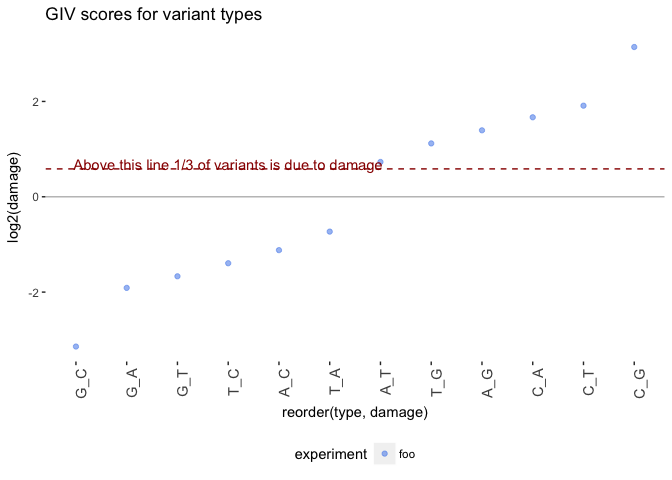

# DNA Damage Estimation
Peter Diakumis  
14 July 2017  


```r
library(ggplot2)
library(dplyr)
library(readr)
```

Here we'll run the DNA Damage Estimator scripts from the
[Ettwiller GitHub repo](https://github.com/Ettwiller/Damage-estimator).

# Example Run
An example BAM file was downloaded from
[bds](https://github.com/vsbuffalo/bds-files/tree/master/chapter-11-alignment):


```bash
ls -lLh ../data/example
```

```
total 122680
-rw-r--r--  1 diakumis  10908    60M 14 Jul 11:10 NA12891_CEU_sample.bam
-rw-r--r--  1 diakumis  10908   106K 14 Jul 11:26 NA12891_CEU_sample.bam.bai
```

## Step 1: Split BAM into R1 and R2

### Command Line


```bash
perl ../scripts/split_mapped_reads.pl \
  --bam ../data/example/NA12891_CEU_sample.bam \
  --genome ../data/genome/human_g1k_v37.fasta \
  --mpileup1 ../data/out/out1.mpileup \
  --mpileup2 ../data/out/out2.mpileup
```

### Output


```bash
ls -lLh ../data/out
```

```
total 221432
-rw-r--r--  1 diakumis  10908   1.2K 14 Jul 17:45 foo.damage
-rw-r--r--  1 diakumis  10908    54M 14 Jul 17:01 out1.mpileup
-rw-r--r--  1 diakumis  10908    54M 14 Jul 17:02 out2.mpileup
```


```bash
head -n5 ../data/out/*.mpileup
```

```
==> ../data/out/out1.mpileup <==
1	215622850	G	1	^].	;	]	1
1	215622851	G	1	.	=	]	2
1	215622852	A	1	.	<	]	3
1	215622853	A	1	.	>	]	4
1	215622854	T	1	.	=	]	5

==> ../data/out/out2.mpileup <==
1	215622860	T	1	^].	;	]	1
1	215622861	A	1	.	9	]	2
1	215622862	G	1	.	=	]	3
1	215622863	G	2	.^F,	;=	]F	4,17
1	215622864	A	2	.,	<<	]F	5,18
```

The script uses `samtools mpileup` to output a summary of the read pileup in the
given BAM file. Options used are:

* `-O`: output base positions on reads 
* `-s`: output mapping quality
* `-q`: skip alignments with mapQ smaller than [10]
* `-Q`: skip bases with baseQ/BAQ smaller than [0]


## Step 2: Estimate damage

### Command Line

```bash
perl ../scripts/estimate_damage.pl \
  --mpileup1 ../data/out/out1.mpileup \
  --mpileup2 ../data/out/out2.mpileup \
  --id foo \
  > ../data/out/foo.damage
```

### Output


```bash
head -n5 ../data/out/foo.damage
```

```
33	T_C	foo	5.17234082904787e-05	A_G-T_C	0.380401132513564
29	T_G	foo	4.54539042552691e-05	A_C-T_G	2.17289737814566
12	A_C	foo	2.09185692395926e-05	A_C-T_G	0.460215015240801
9	C_+	foo	0.000178126113288208	C_+-G_+	3.20967422713059
8	G_C	foo	4.9330340626002e-05	C_G-G_C	0.113293854112244
```

### Plot


```r
type_clean <-c("G_T", "C_A", "C_T", "G_A", "T_A", "A_T",
               "A_G", "T_C", "C_G", "G_C", "T_G", "A_C")
mut <- readr::read_tsv("../data/out/foo.damage",
                       col_names =  c("abs", "type", "experiment", "count", "family", "damage"),
                       col_types = "iccdcd") %>% 
  filter(type %in% type_clean) %>% 
  mutate(type = factor(type, level = type_clean))

#coloring scheme (feel free to change)
local_color <- c("cornflowerblue", "royalblue4", paste0("grey", c(1, seq(10, 100, 10))))

d <- ggplot(mut, aes(x = reorder(type, damage), y = log2(damage), color = experiment))

d + geom_point(alpha = 0.6, size=1.5) +
  scale_colour_manual(values = local_color) +
  geom_hline(yintercept = log2(1.5), color = "#990000", linetype = "dashed") +
  annotate("text", x = 4, y = log2(1.6), color = "#990000",
           label = "Above this line 1/3 of variants is due to damage") +
  geom_hline(yintercept = 0, color = "grey") +
  theme(panel.background = element_rect(fill = 'white', colour = 'white'), 
        legend.position = "bottom", axis.text.x = element_text(angle = 90, hjust = 1, size=11)) +
  ggtitle("GIV scores for variant types")
```

<!-- -->

